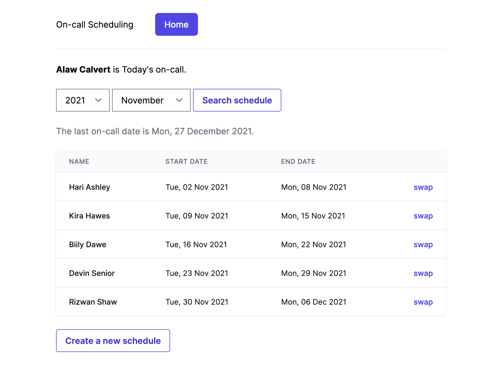
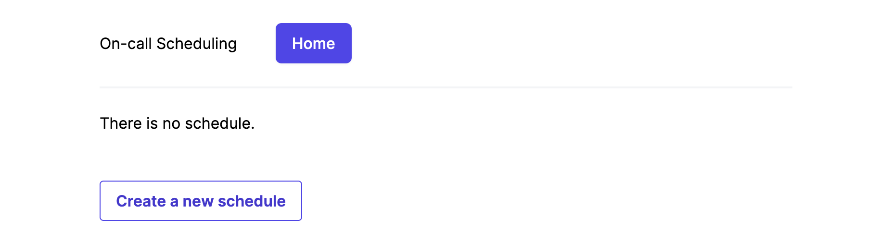
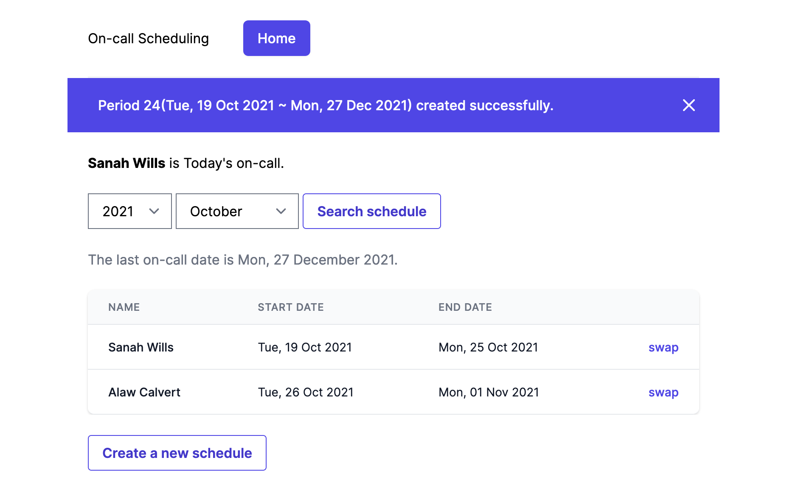
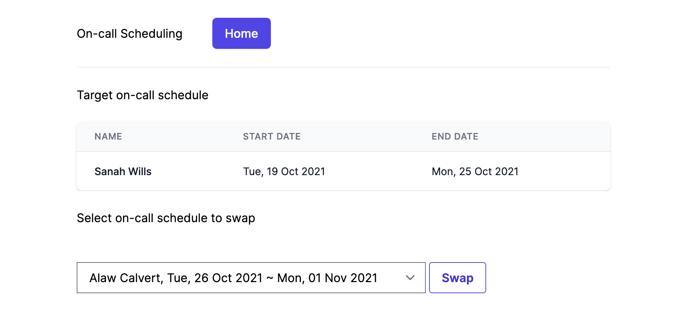
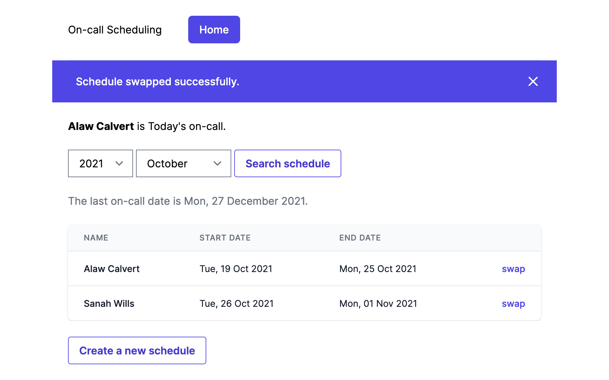

# On-call Scheduling

An application for scheduling on-call rotations for the engineering team.



## View Demo

To access the demo site, click the link below.

https://on-call-scheduling.herokuapp.com/

## Use cases

On-call Scheduling has the below features.

### Create a new schedule

1. Click 'Create a new schedule'



2. It shows index page with success alert and schedules.



 ※ The default period unit is 1 week (7 days).

### Show who is the person currently on-call

Check '`Someone's name` is Today's on-call.' from index page.


## Search who are/were and they are/were on-call for a given month

1. Select year and month and Click 'Search schedule' button.
2. It shows index page with the schedules for a given month.


### Swap one's on-call schedule with another person

1. Click 'swap' link of a schedule from the table.
2. Select schedule to swap and Click 'Swap' button.



3. It shows index page with changed schedule and success notice.



※ You can swap the schedule only within the period.

## Getting Started

I recommend you to use [Homebrew](https://brew.sh/) to install the below tools If you use macOS.

### Prerequisites

#### Ruby

Install `rbenv` to avoid version compatibility issues.

```shell
$ brew install rbenv
```

Install Ruby 3.0.2 with `rbenv`.

(It takes a few minutes.)

```shell
$ rbenv install 3.0.2
$ rbenv global 3.0.2
```

Check the applied Ruby version.

```shell
$ ruby -v
ruby 3.0.2p107 (2021-07-07 revision 0db68f0233) [x86_64-darwin20]
```

And Check Bundler version.

```shell
$ bundle -v
Bundler version 2.2.22
```

#### PostgreSQL

Install PostgreSQL 14.

```shell
$ brew install postresql@14
```
```shell
$ postgres --version
postgres (PostgreSQL) 14.0
```

Start PostgreSQL.

```shell
$ brew services start postgresql
```

```shell
$ brew services list
Name       Status  User      Plist
postgresql started your_name /Users/your_name/Library/LaunchAgents/homebrew.mxcl.postgresql.plist
```

### Setup

#### Repository

Clone this repository anywhere you want.

```shell
$ git clone git@github.com:kimu-donhi/on-call-scheduling.git
```

Install the gems specified by the Gemfile.lock.

```

$ cd on-call-scheduling
$ bundle install
.
.
.
Bundle complete! 22 Gemfile dependencies, 92 gems now installed.
Use `bundle info [gemname]` to see where a bundled gem is installed.
```

#### Database

Use `rails db` to set up the database.

```shell
$ bin/rails db:create   # create a database.
$ bin/rails db:migrate  # create the tables in the database.
$ bin/rails db:seed     # Insert the member records to the members table.
```

## Usage

### How to start a server

1. Start rails server.

```shell
$ bin/rails server
```

2. Open http://localhost:3000 with a browser.

### Test Execution

Execute all the testing codes.

```shell
$ bin/rspec spec
```

Execute unit test(model spec) only.

```shell
$ bin/rspec spec/models
```

Execute functional test(request spec) only.

```shell
$ bin/rspec spec/requests
```


## Note

### To Do

Belows are not implemented or applied yet.

- Authentication and authorization.
- Configure period unit time.
- Add a new member.
- Notify today's on-call.
- Enhanced UX/UI.
